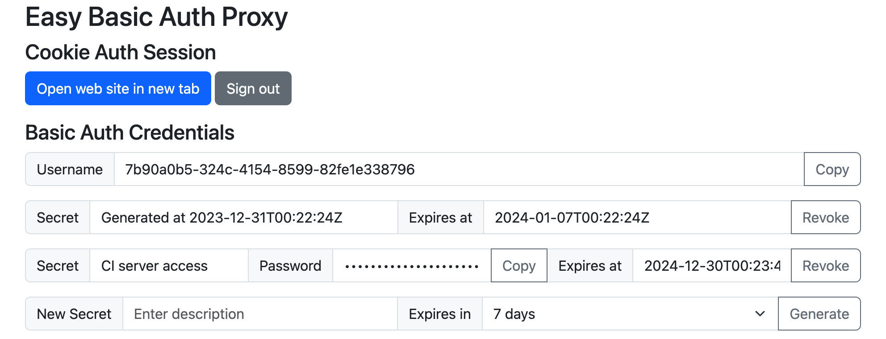
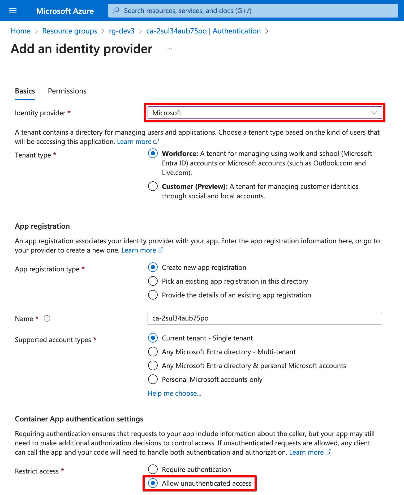

# easy-basic-auth-proxy

## Introduction

**easy-basic-auth-proxy** is a web authentication frontend proxy that supports Azure Easy Auth and standard HTTP Cookie/Basic Auth.

> 

This proxy allows Easy Auth authenticated users to manage multiple sets of Basic Auth credentials. Each set consists of a common username and a randomly generated secret string with a specific expiration time.  These Basic Auth credentials are particularly useful for legacy applications that cannot directly support modern authentication methods.

The public container image of easy-basic-auth-proxy is readily available on the GitHub container registry:

- [`ghcr.io/yaegashi/easy-basic-auth-proxy`](https://github.com/yaegashi/easy-basic-auth-proxy/pkgs/container/easy-basic-auth-proxy)

Sample application of easy-basic-auth-proxy:

- [yaegashi/dx2devops-nuget-server](https://github.com/yaegashi/dx2devops-nuget-server)
... Private NuGet server on Azure Container Apps

## Configuration

The configuration of easy-basic-auth-proxy can be managed through environment variables.

|Variable|Default|Description|
|-|-|-|
|`EBAP_LISTEN`|`:8080`|`host:port` for the proxy to listen on|
|`EBAP_AUTH_PATH`|`/auth`|Proxy configuration path|
|`EBAP_TARGET_URL`|`http://127.0.0.1:8081`|Proxy target URL|
|`EBAP_ACCOUNTS_DIR`|`accounts`|User account data directory|
|`EBAP_DEVELOPMENT`||Development mode (enabled if not empty)|
|`EBAP_SESSION_KEY`||Session encryption key (arbitrary random string)|

## Sample solution overview

This project contains sample solutions that demonstrate the use of easy-basic-auth-proxy in a multi-container configuration.  They comprise the following containerized components:

- `ghcr.io/yaegashi/easy-basic-auth-proxy:main`
- `traefik/whoami`

The following endpoints are available on a single web server:

|URL path|Component|Description|
|-|-|-|
|`/`|traefik/whoami|whoami website|
|`/auth`|easy-basic-auth-proxy|Configuration for Easy Basic Auth Proxy|
|`/auth/debug`|easy-basic-auth-proxy|Dump request headers for debugging|
|`/.auth/login/aad`|Easy Auth|Login via Easy Auth (Microsoft Entra ID)|

## Sample solution with Docker Compose

Use Docker Compose and the provided [compose.yml](compose.yml) file to deploy this solution.
This method is recommended for local development.

```console
$ docker compose up -d
```

## Sample solution with Azure Container Apps

Use [Azure Developer CLI](https://learn.microsoft.com/en-us/azure/developer/azure-developer-cli/overview) to deploay this solution on Azure Container Apps.

```console
$ mkdir my-solution
$ cd my-solution
$ azd init -t https://github.com/yaegashi/easy-basic-auth-proxy
$ azd auth login
$ azd provision
```

After provisioning Azure resources with the CLI,
you need to enable the built-in authentication for the container app in the Azure Portal.
- Select **Microsoft** as the **Identity provider** (Microsoft Entra ID)
- Enable **Allow unauthenticated access** in the **Restrict access** options

> 